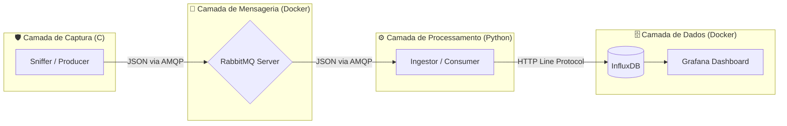

# 📡 Network Traffic Analyzer (Microservices Edition)


O **Network Traffic Analyzer** é um sistema de monitoramento de rede de alta performance desenvolvido em **C (C11)** e **Python**.

Diferente de sniffers tradicionais monolíticos, este projeto utiliza uma **Arquitetura de Microsserviços orientada a eventos**. Ele desacopla a captura de pacotes do processamento de banco de dados usando filas de mensagens (AMQP), garantindo que o sniffer nunca perca pacotes (*packet loss*) mesmo quando o banco de dados estiver sob carga pesada.

---

# ⚠️ Aviso de Segurança e Ética

> **IMPORTANTE:** Este software foi desenvolvido estritamente para fins educacionais e de pesquisa em segurança defensiva (Blue Team).
>
> - **Ambiente de Execução:** Deve ser operado exclusivamente em redes laboratoriais isoladas, redes privadas autorizadas ou localhost.
> - **Propósito:** Estudar a pilha TCP/IP, compreender o funcionamento de Message Brokers e praticar C e Python em arquitetura de rede.
> - **Isenção de Responsabilidade:** O autor não se responsabiliza pelo uso indevido para monitoramento não autorizado.

---

# 🏗️ Arquitetura do Sistema

O projeto adota o padrão **Producer-Consumer distribuído**.



---

# 🔄 Fluxo de Dados

## 1️⃣ NetworkTrafficAnalyzer (Produtor)

- Captura bruta via **libpcap** (Promiscuous Mode).
- Analisa cabeçalhos **Ethernet, IP, TCP/UDP**.
- Serializa os dados para **JSON**.
- Publica na fila `traffic_queue` do RabbitMQ.

## 2️⃣ RabbitMQ (Broker)

- Atua como buffer de alta performance.
- Garante persistência temporária caso o consumidor caia.

## 3️⃣ DataIngestor (Consumidor)

- Serviço em **Python** executando em loop infinito.
- Consome mensagens da fila usando `pika`.
- Converte JSON para **Influx Line Protocol**.
- Envia para o banco via **HTTP**.

## 4️⃣ Visualização

- **InfluxDB:** Armazena séries temporais.
- **Grafana:** Renderiza gráficos de throughput, protocolos e alertas.

---

# 💻 Tech Stack

| Componente | Tecnologia | Descrição |
|------------|------------|------------|
| Linguagem Core | C (C11) | Performance crítica e gestão manual de memória |
| Linguagem Ingestão| Python 3 | Consumidor AMQP, scripts e envio para o banco |
| Captura | libpcap | Biblioteca padrão para captura de pacotes |
| Mensageria | RabbitMQ-C / Pika | Comunicação assíncrona entre o C e o Python |
| Database | InfluxDB | Banco NoSQL otimizado para Time Series |
| Dashboard | Grafana | Interface visual para análise |
| Infraestrutura | Docker Compose | Orquestração dos containers |

---

# 📂 Estrutura de Diretórios

```text
Network-Traffic-Analyzer/
├── include/                 # Headers (.h)
│   ├── analyzer.h           # Lógica de análise
│   ├── capture.h            # Configuração do pcap
│   ├── output.h             # Formatação
│   └── publisher.h          # Cliente RabbitMQ (Produtor)
├── src/                     # Código Fonte
│   ├── analysis/            # Implementação da análise (C)
│   ├── capture/             # Implementação da captura (C)
│   ├── ingestor/            # Consumidor Rabbit -> Influx
│   │   ├── data_ingestor.py # Consumidor novo em Python
│   │   └── ingestor_obsoleto.c # Código legado em C
│   ├── output/              # Serialização e envio (C)
│   └── main.c               # Sniffer Principal (C)
├── docker-compose.yml       # Infraestrutura (Rabbit + Influx + Grafana)
├── CMakeLists.txt           # Configuração de Build do C
├── requirements.txt         # Dependências do Python
├── .gitignore               # Regras do Git
└── README.md                # Documentação
```

---

# 🛠️ Pré-requisitos e Instalação

Sistema alvo: **Linux (Ubuntu / Debian / Kali)**

## 1️⃣ Dependências do Sistema

```bash
# Compiladores e ferramentas
sudo apt update
sudo apt install build-essential cmake git

# Bibliotecas de desenvolvimento
sudo apt install libpcap-dev librabbitmq-dev

# Python e Docker
sudo apt install python3 python3-venv python3-pip docker.io docker-compose-plugin
```

---

## 2️⃣ Compilação (CMake)

```bash
mkdir build
cd build
cmake ..
make
```

Executável gerado:

- `NetworkTrafficAnalyzer`

---

# ▶️ Como Rodar (Passo a Passo)

É necessário executar **3 componentes simultaneamente** (recomenda-se 3 terminais).

---

## 🔹 Passo 1: Subir a Infraestrutura

Na raiz do projeto:

```bash
sudo docker compose up -d
```

Aguarde até que todos os containers estejam com status `Started`.

---

## 🔹 Passo 2: Iniciar o Consumidor (Ingestor Python)

Na raiz do projeto, ative o ambiente virtual e rode o script:

```bash
python3 -m venv .venv
source .venv/bin/activate
pip install -r requirements.txt
python src/ingestor/data_ingestor.py
```

---

## 🔹 Passo 3: Iniciar o Sniffer (Produtor C)

Substitua `wlp2s0` pela sua interface de rede.

```bash
cd build
sudo ./NetworkTrafficAnalyzer wlp2s0
```

---

# 📊 Acessando os Dashboards

| Serviço | URL | Usuário | Senha |
|----------|------|----------|--------|
| RabbitMQ Admin | http://localhost:15673 | guest | guest |
| InfluxDB UI | http://localhost:8086 | admin | adminpassword123 |
| Grafana | http://localhost:3000 | admin | admin |

---

# 📝 Licença

Distribuído sob a **Licença MIT**.

Sinta-se livre para contribuir, criar forks e abrir Pull Requests.
