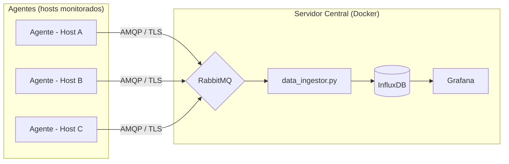

# Network Traffic Analyzer


O **Network Traffic Analyzer** é um sistema de monitoramento e detecção de intrusão (IDS) de alta performance desenvolvido em C (C11), com arquitetura inspirada no modelo **Agent/Server do Zabbix**.

Cada agente roda em um host monitorado, captura pacotes via libpcap/Npcap e os envia para um servidor central. O servidor consolida os dados de múltiplos agentes, processa a telemetria e exibe tudo em dashboards Grafana em tempo real.

---

## Aviso de Segurança

> Este software foi desenvolvido estritamente para fins educacionais e de pesquisa em segurança defensiva (Blue Team).
>
> - Execute exclusivamente em redes laboratoriais isoladas, redes privadas autorizadas ou localhost.
> - O autor não se responsabiliza pelo uso em monitoramento não autorizado.

---

## Arquitetura: Agent/Server

```
[Host A] libpcap → Agente C ──┐
[Host B] libpcap → Agente C ──┼──→ RabbitMQ Central → data_ingestor.py → InfluxDB → Grafana
[Host C] libpcap → Agente C ──┘         (Servidor)
```


```mermaid
flowchart LR
    subgraph Agents["Agentes (hosts monitorados)"]
        A1[Agente - Host A]
        A2[Agente - Host B]
        A3[Agente - Host C]
    end

    subgraph Server["Servidor Central (Docker)"]
        B{RabbitMQ}
        C[data_ingestor.py]
        D[(InfluxDB)]
        E[Grafana]
    end

    A1 -->|AMQP / TLS| B
    A2 -->|AMQP / TLS| B
    A3 -->|AMQP / TLS| B
    B --> C
    C --> D
    D --> E
```

### Responsabilidades

| Componente | Onde roda | Função |
|------------|-----------|--------|
| **Agente (C)** | Host monitorado | Captura pacotes, detecta anomalias, envia telemetria |
| **RabbitMQ** | Servidor central | Buffer de mensagens durável entre agentes e ingestor |
| **data_ingestor.py** | Servidor central | Consome fila, enriquece com GeoIP, grava no InfluxDB |
| **InfluxDB** | Servidor central | Armazena séries temporais de tráfego |
| **Grafana** | Servidor central | Dashboards e alertas em tempo real |

---

## Fluxo de Dados

1. **Captura:** libpcap (Linux) / Npcap (Windows) intercepta pacotes em modo promíscuo.
2. **Análise:** `analyzer.c` classifica o tráfego — detecta Port Scan (≥15 portas únicas) e ICMP Flood (≥20 pacotes).
3. **Publicação:** `publisher.c` serializa o evento em JSON e publica na fila via AMQP.
4. **Ingestão:** `data_ingestor.py` consome a fila, enriquece com geolocalização e grava no InfluxDB.
5. **Visualização:** Grafana exibe os dados em tempo real via Flux query.

---

## Tech Stack

| Componente | Tecnologia | Descrição |
|------------|------------|-----------|
| Linguagem Core | C (C11) | Performance crítica, gestão manual de memória |
| Captura (Linux) | libpcap | Captura de pacotes em modo promíscuo |
| Captura (Windows) | Npcap SDK | Drop-in replacement do libpcap para Windows |
| Mensageria | librabbitmq | Cliente AMQP com suporte a TCP e TLS/SSL |
| JSON | cJSON | Serialização leve embutida no projeto |
| Ingestor | Python 3 + pika | Consumidor flexível com enriquecimento GeoIP |
| Banco de dados | InfluxDB 2.7 | Time series otimizado para telemetria |
| Dashboard | Grafana | Interface visual com alertas |
| Infraestrutura | Docker Compose | Orquestração do servidor central |

---

## Estrutura de Diretórios

```
Network-Traffic-Analyzer/
├── include/
│   ├── analyzer.h        # Interface do motor IDS
│   ├── capture.h         # Interface da camada de captura
│   ├── cJSON.h           # Parser JSON (embutido)
│   └── publisher.h       # Interface do cliente AMQP
├── src/
│   ├── analysis/
│   │   └── analyzer.c    # Detecção de Port Scan e ICMP Flood
│   ├── capture/
│   │   └── capture.c     # Captura via libpcap / Npcap
│   ├── ingestor/
│   │   └── data_ingestor.py  # Worker Python: RabbitMQ → InfluxDB
│   └── output/
│       ├── cJSON.c        # Implementação do parser JSON
│       └── publisher.c    # Cliente AMQP (TCP / TLS)
│   └── main.c             # Ponto de entrada do agente
├── docker-compose.yml     # Infraestrutura do servidor central
├── CMakeLists.txt         # Build multiplataforma (Linux / Windows)
├── requirements.txt       # Dependências Python do ingestor
└── README.md
```

---

## Pré-requisitos

### Linux (Ubuntu / Debian / Kali)

```bash
sudo apt update
sudo apt install build-essential cmake git
sudo apt install libpcap-dev librabbitmq-dev
sudo apt install docker.io docker-compose-plugin
```

### Windows

- [Npcap](https://npcap.com/) instalado com "WinPcap API compatibility mode"
- [Npcap SDK](https://npcap.com/dist/npcap-sdk-1.13.zip) extraído em `C:\Npcap-sdk`
- [librabbitmq-c](https://github.com/alanxz/rabbitmq-c) compilado com CMake
- Visual Studio 2022 ou MinGW-w64

---

## Compilação

### Linux

```bash
cmake -B build -S .
cmake --build build
```

### Windows (Visual Studio)

```powershell
cmake -B build -S . -DNPCAP_SDK_DIR="C:/Npcap-sdk"
cmake --build build --config Release
```

Binário gerado: `build/NetworkTrafficAnalyzer`

---

## Como Rodar

### 1. Servidor Central — subir infraestrutura

```bash
docker compose up -d
```

### 2. Servidor Central — iniciar o ingestor

```bash
cd build
python3 data_ingestor.py
```

### 3. Agente — iniciar o sensor

Sem argumentos, o agente lista as interfaces disponíveis:

```bash
sudo ./build/NetworkTrafficAnalyzer
# Interfaces disponiveis:
#   1. eth0  (Ethernet)
#   2. wlan0 (Wi-Fi)
```

Com a interface escolhida:

```bash
sudo ./build/NetworkTrafficAnalyzer eth0
```

No Windows (Prompt como Administrador):

```powershell
.\build\NetworkTrafficAnalyzer.exe
```

---

## Configuração do Agente (Variáveis de Ambiente)

O agente é configurado inteiramente por variáveis de ambiente — sem necessidade de recompilar para mudar de servidor.

| Variável | Padrão | Descrição |
|----------|--------|-----------|
| `AGENT_SERVER_HOST` | `localhost` | Endereço do servidor RabbitMQ central |
| `AGENT_SERVER_PORT` | `5674` | Porta do broker (5671 para TLS) |
| `AGENT_VHOST` | `/` | Virtual host do RabbitMQ |
| `AGENT_ID` | `guest` | Identidade do agente (usuário AMQP) |
| `AGENT_TOKEN` | `guest` | Credencial/senha do agente |
| `AGENT_QUEUE` | `traffic_queue` | Nome da fila de telemetria |
| `AGENT_USE_TLS` | `0` | `1` ativa TLS/SSL na conexão |
| `AGENT_CA_CERT` | _(nenhum)_ | Caminho para o certificado CA (`.pem`) |

### Exemplo — agente apontando para servidor remoto com TLS

```bash
export AGENT_SERVER_HOST=edr-server.empresa.com
export AGENT_SERVER_PORT=5671
export AGENT_ID=agente-host-a
export AGENT_TOKEN=TOKEN_SECRETO
export AGENT_USE_TLS=1
export AGENT_CA_CERT=/etc/agente/ca.pem

sudo ./build/NetworkTrafficAnalyzer eth0
```

### Exemplo — teste local (infra padrão Docker)

```bash
sudo ./build/NetworkTrafficAnalyzer eth0
# Usa todos os valores padrão (localhost:5674, guest/guest, sem TLS)
```

---

## Dashboards

| Serviço | URL | Usuário | Senha |
|---------|-----|---------|-------|
| RabbitMQ Admin | http://localhost:15673 | guest | guest |
| InfluxDB UI | http://localhost:8086 | admin | adminpassword123 |
| Grafana | http://localhost:3000 | admin | admin |

---

## Licença

Distribuído sob a **Licença MIT**. Contribuições via Pull Request são bem-vindas.
