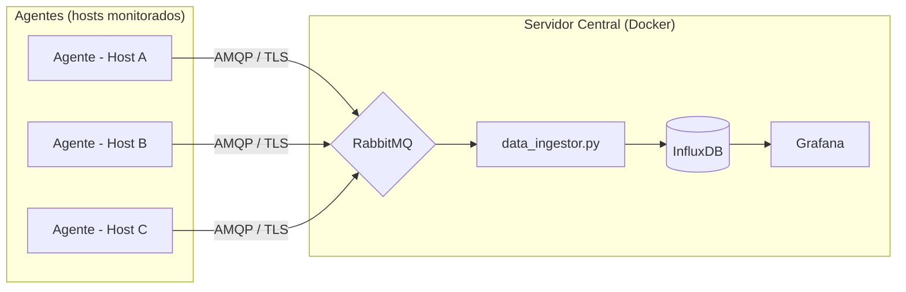

# Network Traffic Analyzer


O **Network Traffic Analyzer** é um sistema de monitoramento e detecção de intrusão (IDS) de alta performance desenvolvido em C (C11), com arquitetura inspirada no modelo **Agent/Server do Zabbix**.

Cada agente roda em um host monitorado, captura pacotes via libpcap/Npcap, detecta ataques comportamentalmente com **baseline EWMA adaptativo** e **kill chain correlator**, e envia os eventos enriquecidos com tags MITRE ATT&CK para um servidor central via AMQP.

---

## Aviso de Segurança

> Este software foi desenvolvido estritamente para fins educacionais e de pesquisa em segurança defensiva (Blue Team).
>
> - Execute exclusivamente em redes laboratoriais isoladas, redes privadas autorizadas ou localhost.
> - O autor não se responsabiliza pelo uso em monitoramento não autorizado.

---

## Detecções (v4.0)

O motor IDS cobre 8 vetores de ataque com detecção comportamental adaptativa:

| Detecção | Protocolo | MITRE ATT&CK | Descrição |
|---|---|---|---|
| Port Scan | TCP | T1046 | ≥15 portas únicas por IP |
| ICMP Flood | ICMP | T1498 | Volume anômalo de pacotes ICMP |
| SYN Flood | TCP | T1498 | SYNs sem ACK acima do baseline |
| Null Scan | TCP | T1046 | Pacotes com flags=0x00 |
| Xmas Scan | TCP | T1046 | FIN+PSH+URG simultâneos |
| SYN/FIN Scan | TCP | T1046 | SYN+FIN simultâneos (inválido por RFC) |
| Brute Force | TCP | T1110 | ≥30 SYNs para portas 22/21/3389 em 60s |
| DNS Tunneling | UDP/DNS | T1071.004, T1048 | Entropia alta / subdomain longo / volume anômalo |
| ARP Spoofing | ARP | T1557 | MAC reivindicando IPs diferentes |
| DDoS Amplification | UDP/DNS | T1498 | Ratio response/request > 10:1 |

### Baseline EWMA adaptativo

Cada IP rastreado mantém médias móveis exponencialmente ponderadas de pps, portas/min e DNS queries/min. Os thresholds hardcoded são usados apenas durante a calibração (primeiras 100 amostras); depois, o IDS aprende os limites normais de cada rede.

### Kill Chain Correlator

Máquina de estados por IP: `IDLE → RECON → EXPLOIT → EXFIL → COMPLETE`

Cada detecção avança o estágio e acumula um score 0–100. Todos os eventos de um mesmo incidente são correlacionados e publicados com `kill_chain_stage`, `kc_score` e `mitre_technique` no JSON.

---

## Arquitetura

```
[Host A] libpcap → Agente C ──┐
[Host B] libpcap → Agente C ──┼──→ RabbitMQ Central → InfluxDB → Grafana
[Host C] libpcap → Agente C ──┘
```


```mermaid
flowchart LR
    subgraph Agents["Agentes (hosts monitorados)"]
        A1[Agente - Host A]
        A2[Agente - Host B]
        A3[Agente - Host C]
    end

    subgraph Server["Servidor Central (Docker)"]
        B{RabbitMQ}
        C[data_ingestor.py]
        D[(InfluxDB)]
        E[Grafana]
    end

    A1 -->|AMQP / TLS| B
    A2 -->|AMQP / TLS| B
    A3 -->|AMQP / TLS| B
    B --> C
    C --> D
    D --> E
```

| Componente | Onde roda | Função |
|---|---|---|
| **Agente (C)** | Host monitorado | Captura, detecta (EWMA + kill chain), publica telemetria |
| **RabbitMQ** | Servidor central | Buffer de mensagens durável |
| **data_ingestor.py** | Servidor central | RabbitMQ → InfluxDB com enriquecimento GeoIP |
| **InfluxDB** | Servidor central | Armazena séries temporais |
| **Grafana** | Servidor central | Dashboards e alertas em tempo real |

---

## Estrutura de Diretórios

```
Network-Traffic-Analyzer/
├── include/
│   ├── analyzer.h        # Interface do motor IDS
│   ├── capture.h         # Interface da camada de captura
│   ├── cJSON.h           # Parser JSON (embutido)
│   ├── collector.h       # Coletor de detecções para replay (v4.1)
│   ├── publisher.h       # Interface do cliente AMQP
│   └── replay.h          # Framework de replay e test (v4.1)
├── src/
│   ├── analysis/
│   │   ├── analyzer.c    # IDS: 10 detectores + EWMA + Kill Chain
│   │   └── collector.c   # Array em memória de eventos detectados
│   ├── capture/
│   │   └── capture.c     # Captura via libpcap / Npcap
│   ├── ingestor/
│   │   └── data_ingestor.py
│   ├── output/
│   │   ├── cJSON.c
│   │   └── publisher.c   # AMQP com kill_chain_stage + MITRE no JSON
│   ├── replay/
│   │   └── replay.c      # --replay / --replay-dir / gabarito JSON
│   └── main.c
├── tests/
│   └── pcaps/            # Gabaritos JSON por tipo de ataque
├── .github/
│   └── workflows/
│       └── test-ids.yml  # CI/CD: build + replay, falha se score < 80%
├── docker-compose.yml
├── CMakeLists.txt
└── README.md
```

---

## Pré-requisitos

### Linux (Ubuntu / Debian / Kali)

```bash
sudo apt update
sudo apt install build-essential cmake git
sudo apt install libpcap-dev librabbitmq-dev
sudo apt install docker.io docker-compose-plugin
```

### Windows

- [Npcap](https://npcap.com/) instalado com "WinPcap API compatibility mode"
- [Npcap SDK](https://npcap.com/dist/npcap-sdk-1.13.zip) extraído em `C:\Npcap-sdk`
- [librabbitmq-c](https://github.com/alanxz/rabbitmq-c) compilado com CMake
- Visual Studio 2022 ou MinGW-w64

---

## Compilação

### Linux

```bash
cmake -B build -S .
cmake --build build
```

### Windows (Visual Studio)

```powershell
cmake -B build -S . -DNPCAP_SDK_DIR="C:/Npcap-sdk"
cmake --build build --config Release
```

Binário gerado: `build/NetworkTrafficAnalyzer`

---

## Como Rodar

### Modo live — captura de interface

```bash
# Sem argumentos: lista interfaces disponíveis
sudo ./build/NetworkTrafficAnalyzer

# Com interface escolhida
sudo ./build/NetworkTrafficAnalyzer eth0
```

### Modo replay — validar IDS contra pcap (v4.1)

Não requer `sudo` nem RabbitMQ em execução.

```bash
# Arquivo único com gabarito
./build/NetworkTrafficAnalyzer \
  --replay tests/pcaps/syn-flood.pcap \
  --expect tests/pcaps/syn-flood.json

# Diretório completo com relatório JSON
./build/NetworkTrafficAnalyzer \
  --replay-dir tests/pcaps/ \
  --report tests/report.json
```

Saída esperada:

```
[REPLAY] Processando: tests/pcaps/syn-flood.pcap

RESULTADO      ATTACK_TYPE     SRC_IP
---------      -----------     ------
[PASS]         SYN_FLOOD       192.168.1.100

Score: 100.0%  (1/1 detecções corretas)
```

### Infraestrutura do servidor central

```bash
docker compose up -d
cd build && python3 data_ingestor.py
```

---

## Configuração do Agente (Variáveis de Ambiente)

| Variável | Padrão | Descrição |
|---|---|---|
| `AGENT_SERVER_HOST` | `localhost` | Endereço do servidor RabbitMQ |
| `AGENT_SERVER_PORT` | `5674` | Porta (5671 para TLS) |
| `AGENT_VHOST` | `/` | Virtual host do RabbitMQ |
| `AGENT_ID` | `guest` | Identidade do agente |
| `AGENT_TOKEN` | `guest` | Credencial/senha |
| `AGENT_QUEUE` | `traffic_queue` | Nome da fila |
| `AGENT_USE_TLS` | `0` | `1` ativa TLS/SSL |
| `AGENT_CA_CERT` | _(nenhum)_ | Caminho para o certificado CA `.pem` |

```bash
# Exemplo — agente remoto com TLS
export AGENT_SERVER_HOST=ids-server.empresa.com
export AGENT_SERVER_PORT=5671
export AGENT_ID=agente-host-a
export AGENT_TOKEN=TOKEN_SECRETO
export AGENT_USE_TLS=1
export AGENT_CA_CERT=/etc/agente/ca.pem

sudo ./build/NetworkTrafficAnalyzer eth0
```

---

## Formato do Evento JSON publicado

```json
{
  "src_ip": "192.168.1.50",
  "port": 22,
  "proto": "TCP",
  "bytes": 74,
  "is_scan": 1,
  "attack_type": "BRUTE_FORCE",
  "kill_chain_stage": "EXPLOIT",
  "kc_score": 60,
  "mitre_technique": "T1110"
}
```

---

## Test Framework (v4.1)

### Gabarito JSON

```json
{
  "expected": [
    { "attack_type": "SYN_FLOOD", "src_ip": "192.168.1.10" },
    { "attack_type": "DNS_TUNNEL", "src_ip": "10.0.0.5",
      "time_window": { "start_sec": 0, "end_sec": 60 } }
  ]
}
```

Os arquivos `.pcap` de teste devem ser obtidos de datasets públicos (ver [tests/pcaps/README.md](tests/pcaps/README.md)).

### CI/CD

O workflow `.github/workflows/test-ids.yml` executa a cada push/PR:
1. Compila o agente
2. Roda `--replay-dir tests/pcaps/`
3. Falha automaticamente se o score agregado cair abaixo de 80%

---

## Dashboards

| Serviço | URL | Usuário | Senha |
|---|---|---|---|
| RabbitMQ Admin | http://localhost:15673 | guest | guest |
| InfluxDB UI | http://localhost:8086 | admin | adminpassword123 |
| Grafana | http://localhost:3000 | admin | admin |

---

## Roadmap

| Versão | Feature | Status |
|---|---|---|
| v1.0 | Captura de pacotes (libpcap) | ✅ |
| v2.0 | Mensageria RabbitMQ + IDS básico | ✅ |
| v3.0 | Arquitetura Agent/Server + TLS | ✅ |
| v4.0 | IDS Engine avançado (EWMA + Kill Chain + MITRE) | ✅ |
| v4.1 | PCAP Replay + Test Framework + CI/CD | ✅ |
| v5.0 | Multi-Threading (pthreads + ring buffer lock-free) | 🔜 |
| v5.1 | Validação Windows (Npcap + multi-thread) | Planejado |
| v6.0 | Produção: VPS + Terraform + Nginx + Let's Encrypt | Planejado |
| v7.0 | AI Narrator (LLM via Groq API em C) | Planejado |
| v8.0 | nta-server em C + thread pool adaptativo + RabbitMQ cluster | Planejado |
| v9.0 | Threat Intelligence (GeoIP + AbuseIPDB + IoC matching) | Planejado |
| v10.0 | Alta Performance (AF_PACKET + TPACKET_V3 + zero-copy) | Planejado |

---

## Licença

Distribuído sob a **Licença MIT**. Contribuições via Pull Request são bem-vindas.
