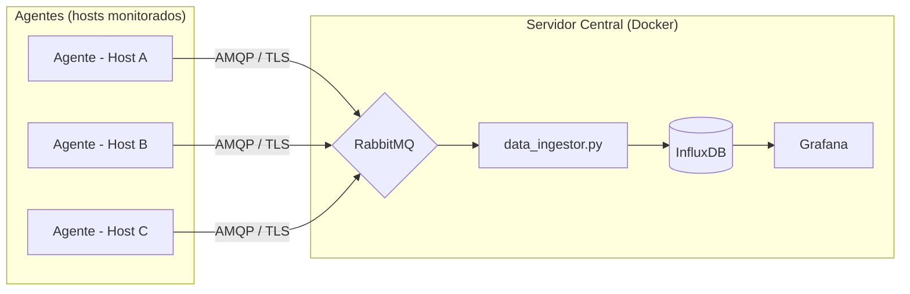

# Network Traffic Analyzer


> **Versão atual: v8.0** — Threat Intelligence em C: GeoLite2-City+ASN, framework IoC (blocklist.json), AbuseIPDB enricher (libcurl+cache 24h) com dual-trigger narrator (kc_score OR abuse_score) e WHOIS nativo (TCP socket :43, sem libs externas) enriquecendo prompt LLM.

O **Network Traffic Analyzer** é um sistema de monitoramento e detecção de intrusão (IDS) de alta performance desenvolvido em C (C11), com arquitetura inspirada no modelo **Agent/Server do Zabbix**.

Cada agente roda em um host monitorado, captura pacotes via libpcap/Npcap, detecta ataques comportamentalmente com **baseline EWMA adaptativo** e **kill chain correlator**, e envia os eventos enriquecidos com tags MITRE ATT&CK para um servidor central via AMQP.

A v7.0 substitui o ingestor Python por um servidor em C (`nta-server`) com pool de workers adaptativo (auto-scale via Mgmt API), narrativa LLM em C (libcurl→Groq) e métricas próprias (`nta_pool`, `incident_narrative`).

---

## Aviso de Segurança

> Este software foi desenvolvido estritamente para fins educacionais e de pesquisa em segurança defensiva (Blue Team).
>
> - Execute exclusivamente em redes laboratoriais isoladas, redes privadas autorizadas ou localhost.
> - O autor não se responsabiliza pelo uso em monitoramento não autorizado.

---

## Detecções (v4.0)

O motor IDS cobre 8 vetores de ataque com detecção comportamental adaptativa:

| Detecção | Protocolo | MITRE ATT&CK | Descrição |
|---|---|---|---|
| Port Scan | TCP | T1046 | ≥15 portas únicas por IP |
| ICMP Flood | ICMP | T1498 | Volume anômalo de pacotes ICMP |
| SYN Flood | TCP | T1498 | SYNs sem ACK acima do baseline |
| Null Scan | TCP | T1046 | Pacotes com flags=0x00 |
| Xmas Scan | TCP | T1046 | FIN+PSH+URG simultâneos |
| SYN/FIN Scan | TCP | T1046 | SYN+FIN simultâneos (inválido por RFC) |
| Brute Force | TCP | T1110 | ≥30 SYNs para portas 22/21/3389 em 60s |
| DNS Tunneling | UDP/DNS | T1071.004, T1048 | Entropia alta / subdomain longo / volume anômalo |
| ARP Spoofing | ARP | T1557 | MAC reivindicando IPs diferentes |
| DDoS Amplification | UDP/DNS | T1498 | Ratio response/request > 10:1 |

### Baseline EWMA adaptativo

Cada IP rastreado mantém médias móveis exponencialmente ponderadas de pps, portas/min e DNS queries/min. Os thresholds hardcoded são usados apenas durante a calibração (primeiras 100 amostras); depois, o IDS aprende os limites normais de cada rede.

### Kill Chain Correlator

Máquina de estados por IP: `IDLE → RECON → EXPLOIT → EXFIL → COMPLETE`

Cada detecção avança o estágio e acumula um score 0–100. Todos os eventos de um mesmo incidente são correlacionados e publicados com `kill_chain_stage`, `kc_score` e `mitre_technique` no JSON.

---

## Pipeline Multi-Thread (v5.0)

O agente roda 4 threads conectadas por ring buffers **SPSC lock-free** (C11 atomics, acquire/release):

```
┌──────────────┐  rb_pkt   ┌──────────────┐  rb_evt   ┌──────────────┐
│  capture_th  │ ────────► │  analysis_th │ ────────► │  publish_th  │
│ (SCHED_FIFO) │ pkt_slot  │  (analyzer)  │ event_slot│ (batch AMQP) │
└──────────────┘           └──────────────┘           └──────────────┘
                                                     │
                                           ┌─────────┴──────────┐
                                           │    metrics_th      │
                                           │ (routing separada) │
                                           └────────────────────┘
```

- **captura** eleva prioridade com `SCHED_FIFO` e chama `pcap_loop`, copiando cada pacote em `rb_pkt` e retornando imediatamente.
- **análise** consome `rb_pkt`, executa EWMA + kill chain e enfileira eventos em `rb_evt`.
- **publicação** agrupa até `AGENT_BATCH_SIZE` eventos (ou `AGENT_BATCH_TIMEOUT_MS`) em um único array JSON via cJSON e dispara uma única chamada AMQP.
- **métricas** publica periodicamente em `AGENT_METRICS_QUEUE` (profundidade dos buffers, overflows, events/s).

Shutdown gracioso: `SIGINT`/`SIGTERM` → `pcap_breakloop` → threads drenam a pipeline e fazem flush final.

---

## Arquitetura

```
[Host A] libpcap → Agente C ──┐
[Host B] libpcap → Agente C ──┼──→ RabbitMQ Central → InfluxDB → Grafana
[Host C] libpcap → Agente C ──┘
```


```mermaid
flowchart LR
    subgraph Agents["Agentes (hosts monitorados)"]
        A1[Agente - Host A]
        A2[Agente - Host B]
        A3[Agente - Host C]
    end

    subgraph Server["Servidor Central (Docker)"]
        B{RabbitMQ}
        C[data_ingestor.py]
        D[(InfluxDB)]
        E[Grafana]
    end

    A1 -->|AMQP / TLS| B
    A2 -->|AMQP / TLS| B
    A3 -->|AMQP / TLS| B
    B --> C
    C --> D
    D --> E
```

| Componente | Onde roda | Função |
|---|---|---|
| **Agente (C)** | Host monitorado | Captura, detecta (EWMA + kill chain), publica telemetria |
| **RabbitMQ** | Servidor central | Buffer de mensagens durável |
| **data_ingestor.py** | Servidor central | RabbitMQ → InfluxDB com enriquecimento GeoIP |
| **InfluxDB** | Servidor central | Armazena séries temporais |
| **Grafana** | Servidor central | Dashboards e alertas em tempo real |

---

## Estrutura de Diretórios

```
Network-Traffic-Analyzer/
├── include/
│   ├── analyzer.h        # Interface do motor IDS
│   ├── capture.h         # Interface da camada de captura
│   ├── cJSON.h           # Parser JSON (embutido)
│   ├── collector.h       # Coletor de detecções para replay (v4.1)
│   ├── pipeline.h        # Pipeline multi-thread e slots SPSC (v5.0)
│   ├── publisher.h       # Cliente AMQP + batch sender + métricas (v5.0)
│   ├── ringbuf.h         # Ring buffer SPSC lock-free (v5.0)
│   └── replay.h          # Framework de replay e test (v4.1)
├── src/
│   ├── analysis/
│   │   ├── analyzer.c    # IDS: 10 detectores + EWMA + Kill Chain
│   │   └── collector.c   # Array em memória de eventos detectados
│   ├── capture/
│   │   └── capture.c     # Captura via libpcap / Npcap (push no rb_pkt)
│   ├── core/
│   │   ├── ringbuf.c     # SPSC lock-free (C11 atomics)
│   │   └── pipeline.c    # 4 threads: capture / analysis / publish / metrics
│   ├── ingestor/
│   │   └── data_ingestor.py   # Consome telemetria + métricas (v5.0)
│   ├── output/
│   │   ├── cJSON.c
│   │   └── publisher.c   # Batch AMQP com array JSON + routing key metrics
│   ├── replay/
│   │   └── replay.c      # --replay / --replay-dir / gabarito JSON
│   └── main.c
├── tests/
│   └── pcaps/            # Gabaritos JSON por tipo de ataque
├── scripts/
│   ├── server-up.sh      # Sobe compose + venv + ingestor em um comando
│   └── smoke-test.sh     # Build + replay + sniff curto (v5.0)
├── deploy/
│   ├── agent.env.example # Template de variáveis de ambiente do agente
│   └── agent.service     # Unit systemd com capabilities + hardening
├── .github/
│   └── workflows/
│       └── test-ids.yml  # CI/CD: build + replay, falha se score < 80%
├── docker-compose.yml
├── requirements.txt
├── CMakeLists.txt
└── README.md
```

---

## Instalação

### Caminho rápido (recomendado)

Um comando do clone até o stack rodando:

```bash
make quickstart
# ou: ./scripts/quickstart.sh
```

Equivale a `install.sh` (instala dependências + builda agente) → `up.sh` (sobe
stack docker + ingestor) → `smoke-test.sh` (valida com replay). Idempotente.

Outros atalhos:

```bash
make install                # só instala deps + builda (não sobe nada)
make install-server         # só dependências do servidor
make install-agent          # só dependências/build do agente
make up                     # sobe stack (background)
make down                   # derruba tudo
make help                   # lista todos os targets
```

`scripts/install.sh` detecta automaticamente Debian/Ubuntu/Kali (apt),
Fedora/RHEL/CentOS (dnf), Arch (pacman), FreeBSD (pkg) e macOS (brew).

---

### Arquitetura

Dois papéis, tipicamente em máquinas separadas:

- **Servidor Central** — agrega eventos de múltiplos agentes (RabbitMQ + InfluxDB + Grafana + nta-server em C + narrator Python via Groq).
- **Agente Sensor** — captura tráfego local e publica no servidor (binário C).

As dependências não se sobrepõem: servidor não precisa de `libpcap` nem
compilador; agente não precisa de Docker nem Python.

---

### Servidor Central — instalação manual

Use só se `make install-server` não funcionar no seu SO.

#### Pré-requisitos

- Runtime OCI: Docker Engine, Docker Desktop, Podman (rootless) ou Podman Desktop
- Python 3.10+ com `pip` e `venv`

**Debian / Ubuntu / Kali:**
```bash
sudo apt update
sudo apt install docker.io docker-compose-plugin python3 python3-venv python3-pip
```

**Fedora / RHEL / CentOS:**
```bash
sudo dnf install moby-engine docker-compose python3 python3-pip
```

> `docker compose` (plugin, sem hífen) e `podman-compose` são equivalentes ao
> `docker-compose` usado nos comandos deste README.

#### Subir o stack

```bash
./scripts/up.sh                 # nta-server em background (default)
./scripts/up.sh --foreground    # nta-server em foreground (Ctrl+C para parar)
./scripts/up.sh --no-ingest     # só infra docker
```

Manual (sem scripts):
```bash
docker compose up -d
python3 -m venv .venv && source .venv/bin/activate
pip install -r requirements.txt
./build/nta-server &
python3 src/ingestor/narrator.py &
```

Acesso:
- Grafana — http://\<host>:3000 · admin/admin *(datasource InfluxDB + dashboard "Network Traffic Analyzer — Visão Geral" já provisionados em `grafana/`)*
- RabbitMQ Management — http://\<host>:15673 · guest/guest

#### Agentes remotos: user dedicado no RabbitMQ

O user `guest` **só aceita login de `localhost`**. Para cada agente remoto:

```bash
docker exec rabbitmq rabbitmqctl add_user agente-01 <senha-forte>
docker exec rabbitmq rabbitmqctl set_permissions -p / agente-01 ".*" ".*" ".*"
```

Depois preencha `AGENT_ID=agente-01` / `AGENT_TOKEN=<senha-forte>` no arquivo
de ambiente do agente.

---

### Agente Sensor — instalação manual

Use só se `make install-agent` não funcionar.

#### Pré-requisitos

**Debian / Ubuntu / Kali:**
```bash
sudo apt update
sudo apt install build-essential cmake git libpcap-dev librabbitmq-dev libcurl4-openssl-dev libmaxminddb-dev pkg-config
```

**Fedora / RHEL / CentOS:**
```bash
sudo dnf install gcc cmake make git libpcap-devel librabbitmq-devel libcurl-devel libmaxminddb-devel pkgconfig
```

**FreeBSD:**
```sh
sudo pkg install cmake git rabbitmq-c curl libmaxminddb pkgconf    # libpcap já vem na base
```

> No FreeBSD as interfaces seguem o driver: `em0`, `igb0`, `re0`, `wlan0`.

#### Compilar

```bash
cmake -B build -S .
cmake --build build -j$(nproc)
```

Binário gerado: `build/NetworkTrafficAnalyzer`.

#### Capturar sem sudo (recomendado)

```bash
sudo setcap cap_net_raw,cap_net_admin+ep ./build/NetworkTrafficAnalyzer
```

Reaplicar após cada rebuild — o arquivo é substituído e perde a capability.

#### Configurar

```bash
sudo install -Dm640 deploy/agent.env.example /etc/default/nta-agent
sudo $EDITOR /etc/default/nta-agent    # preencha AGENT_SERVER_HOST e AGENT_TOKEN
```

Todas as variáveis estão documentadas em
[Configuração do Agente](#configuração-do-agente-variáveis-de-ambiente).

#### Rodar

**One-shot (desenvolvimento):**
```bash
set -a; source /etc/default/nta-agent; set +a
./build/NetworkTrafficAnalyzer "$AGENT_IFACE"
```

**Produção (systemd):**
```bash
sudo install -Dm755 build/NetworkTrafficAnalyzer /opt/nta-agent/NetworkTrafficAnalyzer
sudo install -Dm644 deploy/agent.service /etc/systemd/system/nta-agent.service
sudo systemctl daemon-reload
sudo systemctl enable --now nta-agent
sudo journalctl -u nta-agent -f
```

#### Windows (agente)

- [Npcap](https://npcap.com/) com "WinPcap API compatibility mode"
- [Npcap SDK](https://npcap.com/dist/npcap-sdk-1.13.zip) extraído em `C:\Npcap-sdk`
- [librabbitmq-c](https://github.com/alanxz/rabbitmq-c) compilado com CMake
- Visual Studio 2022 ou MinGW-w64

```powershell
cmake -B build -S . -DNPCAP_SDK_DIR="C:/Npcap-sdk"
cmake --build build --config Release
```

> Pipeline multi-thread (v5.0) usa `pthreads` + `SCHED_FIFO`, específicos de
> Linux. Suporte completo no Windows planejado para a **v5.1**.

---

## Como Rodar

### Modo live — captura de interface

```bash
# Sem argumentos: lista interfaces disponíveis
./build/NetworkTrafficAnalyzer

# Com interface escolhida (precisa root OU setcap aplicado)
./build/NetworkTrafficAnalyzer eth0
```

### Modo replay — validar IDS contra pcap (v4.1)

Não requer privilégio nem RabbitMQ em execução.

```bash
# Arquivo único com gabarito
./build/NetworkTrafficAnalyzer \
  --replay tests/pcaps/syn-flood.pcap \
  --expect tests/pcaps/syn-flood.json

# Diretório completo com relatório JSON
./build/NetworkTrafficAnalyzer \
  --replay-dir tests/pcaps/ \
  --report tests/report.json
```

> ⚠️ O diretório `tests/pcaps/` contém apenas os **gabaritos** (`.json`).
> Os arquivos `.pcap` precisam ser baixados de datasets públicos antes de
> rodar — consulte [tests/pcaps/README.md](tests/pcaps/README.md). Sem eles,
> o replay processa zero arquivos e sai com sucesso vazio.

Saída esperada:

```
[REPLAY] Processando: tests/pcaps/syn-flood.pcap

RESULTADO      ATTACK_TYPE     SRC_IP
---------      -----------     ------
[PASS]         SYN_FLOOD       192.168.1.100

Score: 100.0%  (1/1 detecções corretas)
```

### Smoke test — validação rápida da v5.0

Atalho que executa **build + replay-dir** (e opcionalmente um sniff curto na
interface real):

```bash
./scripts/smoke-test.sh                      # build + replay
sudo ./scripts/smoke-test.sh --live eth0     # adiciona 10s de captura
```

---

## Configuração do Agente (Variáveis de Ambiente)

| Variável | Padrão | Descrição |
|---|---|---|
| `AGENT_SERVER_HOST` | `localhost` | Endereço do servidor RabbitMQ |
| `AGENT_SERVER_PORT` | `5674` | Porta (5671 para TLS) |
| `AGENT_VHOST` | `/` | Virtual host do RabbitMQ |
| `AGENT_ID` | `guest` | Identidade do agente |
| `AGENT_TOKEN` | `guest` | Credencial/senha |
| `AGENT_QUEUE` | `traffic_queue` | Nome da fila |
| `AGENT_USE_TLS` | `0` | `1` ativa TLS/SSL |
| `AGENT_CA_CERT` | _(nenhum)_ | Caminho para o certificado CA `.pem` |
| `AGENT_METRICS_QUEUE` | `traffic_metrics` | Fila de métricas do pipeline (v5.0) |
| `AGENT_BUFFER_SIZE` | `4096` | Slots por ring buffer SPSC (arredondado para pow2) |
| `AGENT_BATCH_SIZE` | `50` | Eventos por publicação AMQP |
| `AGENT_BATCH_TIMEOUT_MS` | `100` | Flush do batch mesmo sem atingir `AGENT_BATCH_SIZE` |
| `AGENT_METRICS_INTERVAL_SEC` | `10` | Intervalo de publicação da thread de métricas |

```bash
# Exemplo — agente remoto com TLS
export AGENT_SERVER_HOST=ids-server.empresa.com
export AGENT_SERVER_PORT=5671
export AGENT_ID=agente-host-a
export AGENT_TOKEN=TOKEN_SECRETO
export AGENT_USE_TLS=1
export AGENT_CA_CERT=/etc/agente/ca.pem

sudo ./build/NetworkTrafficAnalyzer eth0
```

---

## AI Narrator (v6.0)

Quando o `nta-server` recebe um evento com `kc_score >= NARRATOR_MIN_SCORE`, ele republica o evento em `narrator_queue`. O consumer `narrator.py` (standalone) monta o prompt e chama a Groq Cloud API pra gerar narrativa em PT-BR (o que aconteceu, por que é crítico, ação recomendada, MITRE). O texto vai pro InfluxDB como `incident_narrative` e aparece no painel "Narrativas IA" do dashboard.

| Variável | Default | Descrição |
|---|---|---|
| `NARRATOR_ENABLED` | `1` | `0` desliga o narrator |
| `NARRATOR_MIN_SCORE` | `80` | Threshold de `kc_score` pra disparar narrativa |
| `NARRATOR_TIMEOUT` | `8` | Timeout da chamada HTTP ao Groq (segundos) |
| `GROQ_MODEL` | `llama-3.3-70b-versatile` | Modelo Groq |
| `GROQ_API_KEY` | _(nenhum)_ | Lido também de `deploy/secrets/groq.env` |

**Setup:**
```bash
cp deploy/secrets/groq.env.example deploy/secrets/groq.env
$EDITOR deploy/secrets/groq.env       # cole sua GROQ_API_KEY
./scripts/up.sh
```

---

## Dashboard Generator (Groq → Grafana API)

`scripts/dash_gen.py` recebe uma descrição em PT-BR, monta um prompt com o
schema do InfluxDB, chama a Groq Cloud API e **publica o dashboard direto no
Grafana via API** (`POST /api/dashboards/db`). Aparece imediatamente no UI,
é editável via interface e persiste em `grafana_data` (sobrevive a restart).

```bash
# CLI direta — publica no Grafana
./scripts/dash_gen.py --name top-threats \
    --desc "top 10 IPs por kc_score nos últimos 30 min, mais um stat com total de incidentes críticos"

# Via Makefile
make dash NAME=dns-tunnel DESC="DNS tunneling: queries por minuto por src_ip"

# Imprime e não envia (review antes)
./scripts/dash_gen.py -n foo -d "..." --print --no-push

# Publica E grava JSON pra versionar em git
./scripts/dash_gen.py -n foo -d "..." --save-file

# Modelo customizado (default: llama-3.3-70b-versatile)
./scripts/dash_gen.py -n bar -d "..." --model llama-3.1-8b-instant
```

A saída inclui o link direto: `http://localhost:3000/d/<uid>`.

**Pré-requisitos:**
- Stack de pé (`make up`) — Grafana rodando
- `GROQ_API_KEY` em `deploy/secrets/groq.env` (mesmo arquivo do narrator)

**Variáveis de ambiente:**

| Variável | Default | Descrição |
|---|---|---|
| `GROQ_API_KEY` | _(nenhum)_ | Lido também de `deploy/secrets/groq.env` |
| `DASH_GEN_MODEL` | `llama-3.3-70b-versatile` | Modelo p/ geração |
| `DASH_GEN_TIMEOUT` | `120` | Timeout em segundos da chamada |
| `GRAFANA_URL` | `http://localhost:3000` | Endpoint Grafana |
| `GRAFANA_USER` | `admin` | Basic auth user |
| `GRAFANA_PASS` | `admin` | Basic auth password |
| `GRAFANA_API_KEY` | _(vazio)_ | Token de service account (alternativa a USER/PASS) |
| `GRAFANA_FOLDER_UID` | _(vazio = General)_ | Pasta de destino |

**Schema disponível p/ o LLM:**
- `traffic` (tags: `agent_id`, `src_ip`, `protocol`, `attack_type`, `kill_chain_stage`, `mitre`; fields: `port`, `bytes`, `is_scan`, `kc_score`, `lat`, `lon`)
- `pipeline_metrics` (tags: `agent_id`; fields: `rb_pkt_depth`, `rb_evt_depth`, `events_per_sec`, etc.)
- `incident_narrative` (tags: `agent_id`, `src_ip`, `attack_type`, `backend`; fields: `narrative`, `kc_score`)

Dashboards gerados levam tags `nta` + `ai-gen` e UID `nta-ai-<slug>` para
diferenciar dos dashboards versionados manualmente. Re-rodar com mesmo
`NAME` sobrescreve (overwrite=true).

---

## mTLS Multi-Agente (v7.0)

Em deploy com múltiplos sensores, cada agente autentica no broker via certificado cliente — o CN do cert é mapeado para o user RabbitMQ via `ssl_cert_login_from = common_name`. SASL muda de `PLAIN` para `EXTERNAL`, e a senha do user (`AGENT_TOKEN`) deixa de ser usada na conexão.

**Fluxo de provisionamento:**

```bash
# 1. Stack precisa estar de pé (gera CA + cert do broker na 1ª subida)
./scripts/up.sh

# 2. Provisiona o agente com cert cliente
./scripts/provision_agent.sh host-a --mtls
# Saídas:
#   deploy/agent/host-a.env             → /etc/nta/agent.env na máquina remota
#   deploy/secrets/tls/agent-host-a.crt → /etc/nta-agent/agent-host-a.crt
#   deploy/secrets/tls/agent-host-a.key → /etc/nta-agent/agent-host-a.key
#   deploy/secrets/tls/ca.crt           → /etc/nta-agent/ca.crt
```

**Vars novas no agente:**

| Variável | Descrição |
|---|---|
| `AGENT_USE_TLS=1` | Ativa TLS (porta `5671`) |
| `AGENT_CA_CERT` | CA que assinou o cert do broker |
| `AGENT_CLIENT_CERT` | Cert cliente — CN deve bater com `agent-<nome>` |
| `AGENT_CLIENT_KEY` | Chave privada do cert cliente (chmod 600) |

Com `AGENT_CLIENT_CERT` + `AGENT_CLIENT_KEY` presentes, o publisher chama `amqp_ssl_socket_set_key()` e faz `SASL EXTERNAL`. Sem eles, fallback p/ PLAIN com `AGENT_ID`/`AGENT_TOKEN` (compat com agentes legados).

**RabbitMQ:** listener 5671 + `auth_mechanisms = PLAIN, EXTERNAL` em `deploy/rabbitmq/rabbitmq.conf`. Plugin `rabbitmq_auth_mechanism_ssl` habilitado em `deploy/rabbitmq/enabled_plugins`.

**Control plane:** continua via HMAC-SHA256 (`ctl.py`/`agent_ctl.py`) — mTLS cobre só a telemetria AMQP.

**Troubleshooting:**

```bash
# Inspecionar cert emitido
openssl x509 -in deploy/secrets/tls/agent-host-a.crt -noout -subject -issuer

# Verificar chain
openssl verify -CAfile deploy/secrets/tls/ca.crt deploy/secrets/tls/agent-host-a.crt

# Logs do broker ao recusar cert
docker logs rabbitmq | grep -i ssl
```

---

## Retention & Downsampling (v7.0)

O servidor mantém duas camadas de retenção no InfluxDB:

| Bucket | TTL | Origem | Uso |
|---|---|---|---|
| `network_traffic` | 7 dias | Escrita ao vivo do `nta-server` | Dashboards em tempo real, debugging |
| `network_traffic_warm` | 90 dias | Task Flux `downsample_traffic_1m` (1/min) | Tendências históricas, post-mortem |

O `scripts/up.sh` chama `scripts/influx_retention.sh` automaticamente após o RabbitMQ ficar pronto. O script é idempotente — não destrói dados ao re-rodar.

A task de downsampling agrega `traffic` por janela de 1 minuto:
- `bytes` → soma
- `kc_score` → máximo

Resultado gravado em `network_traffic_warm` com `_measurement = traffic_1m`.

Customização (env vars no shell antes de `up.sh`):

| Variável | Default | Descrição |
|---|---|---|
| `INFLUX_HOT_SECONDS` | `604800` (7d) | TTL bucket hot |
| `INFLUX_WARM_SECONDS` | `7776000` (90d) | TTL bucket warm |
| `INFLUX_WARM_BUCKET` | `network_traffic_warm` | Nome do bucket warm |
| `INFLUX_CONTAINER` | `influxdb` | Container alvo |
| `INFLUX_ORG` | `cybersecurity` | Org InfluxDB |
| `INFLUX_TOKEN` | `my-super-secret-auth-token` | Admin token |

Inspeção manual:
```bash
docker exec influxdb influx bucket list
docker exec influxdb influx task list
```

---

## Formato do Evento JSON publicado

A partir da v5.0 o agente publica **lotes** (arrays) de eventos em uma única mensagem AMQP:

```json
[
  {
    "src_ip": "192.168.1.50",
    "port": 22,
    "proto": "TCP",
    "bytes": 74,
    "is_scan": 1,
    "attack_type": "BRUTE_FORCE",
    "kill_chain_stage": "EXPLOIT",
    "kc_score": 60,
    "mitre": "T1110"
  },
  { "src_ip": "10.0.0.5", "port": 53, "proto": "UDP", "bytes": 512, "is_scan": 0,
    "attack_type": "NONE", "kill_chain_stage": "IDLE", "kc_score": 0, "mitre": "" }
]
```

Mensagens de **métricas** (fila `traffic_metrics`):

```json
{
  "rb_pkt_depth": 142,
  "rb_evt_depth": 8,
  "rb_pkt_overflow": 0,
  "rb_evt_overflow": 0,
  "batches_sent": 3127,
  "events_sent": 156340,
  "events_per_sec": 4891.23
}
```

---

## Test Framework (v4.1)

### Gabarito JSON

```json
{
  "expected": [
    { "attack_type": "SYN_FLOOD", "src_ip": "192.168.1.10" },
    { "attack_type": "DNS_TUNNEL", "src_ip": "10.0.0.5",
      "time_window": { "start_sec": 0, "end_sec": 60 } }
  ]
}
```

Os arquivos `.pcap` de teste devem ser obtidos de datasets públicos (ver [tests/pcaps/README.md](tests/pcaps/README.md)).

### CI/CD

O workflow `.github/workflows/test-ids.yml` executa a cada push/PR:
1. Compila o agente
2. Roda `--replay-dir tests/pcaps/`
3. Falha automaticamente se o score agregado cair abaixo de 80%

---

## Dashboards

| Serviço | URL | Usuário | Senha |
|---|---|---|---|
| RabbitMQ Admin | http://localhost:15673 | guest | guest |
| InfluxDB UI | http://localhost:8086 | admin | adminpassword123 |
| Grafana | http://localhost:3000 | admin | admin |

---

## Roadmap

| Versão | Feature | Status |
|---|---|---|
| v1.0 | Captura de pacotes (libpcap) | ✅ |
| v2.0 | Mensageria RabbitMQ + IDS básico | ✅ |
| v3.0 | Arquitetura Agent/Server + TLS | ✅ |
| v4.0 | IDS Engine avançado (EWMA + Kill Chain + MITRE) | ✅ |
| v4.1 | PCAP Replay + Test Framework + CI/CD | ✅ |
| v5.0 | Multi-Threading (pthreads + ring buffer lock-free + batch AMQP) | ✅ |
| v5.5 | DX (install/quickstart/Makefile) + LLM Dashboard Generator | ✅ |
| v5.1 | Validação Windows (Npcap + multi-thread) | Planejado |
| v6.0 | AI Narrator (LLM via Groq) | ✅ migrado para C em v7.0 |
| v7.0 | nta-server em C + narrator C (Groq) + pool adaptativo (Mgmt API) + retention 7d/90d + mTLS multi-agente | ✅ feature-complete · cluster RabbitMQ deferido p/ v10.0 |
| v8.0 | Threat Intelligence (GeoLite2-City+ASN, IoC framework, AbuseIPDB + dual-trigger narrator, WHOIS nativo) | ✅ feature-complete |
| v9.0 | Alta Performance (AF_PACKET + TPACKET_V3 + zero-copy) | Planejado |
| v10.0 | Produção: VPS + Terraform + Nginx + Let's Encrypt (deploy final) | Planejado |

---

## Licença

Distribuído sob a **Licença MIT**. Contribuições via Pull Request são bem-vindas.
