# 📡 Network Traffic Analyzer (Microservices Edition)


O **Network Traffic Analyzer** é um sistema de monitoramento de rede de alta performance desenvolvido **100% em C (C11)**.

Diferente de sniffers tradicionais monolíticos, este projeto utiliza uma **Arquitetura de Microsserviços orientada a eventos**. Ele desacopla a captura de pacotes do processamento de banco de dados usando filas de mensagens (AMQP), garantindo que o sniffer nunca perca pacotes (*packet loss*) mesmo quando o banco de dados estiver sob carga pesada.

---

# ⚠️ Aviso de Segurança e Ética

> **IMPORTANTE:** Este software foi desenvolvido estritamente para fins educacionais e de pesquisa em segurança defensiva (Blue Team).
>
> - **Ambiente de Execução:** Deve ser operado exclusivamente em redes laboratoriais isoladas, redes privadas autorizadas ou localhost.
> - **Propósito:** Estudar a pilha TCP/IP, compreender o funcionamento de Message Brokers e praticar C em baixo nível.
> - **Isenção de Responsabilidade:** O autor não se responsabiliza pelo uso indevido para monitoramento não autorizado.

---

# 🏗️ Arquitetura do Sistema

O projeto adota o padrão **Producer-Consumer distribuído**.

```mermaid
flowchart LR
    subgraph Capture["🛡️ Camada de Captura (C)"]
        A[Sniffer / Producer]
    end

    subgraph Broker["🐰 Camada de Mensageria (Docker)"]
        B{RabbitMQ Server}
    end

    subgraph Ingest["⚙️ Camada de Processamento (C)"]
        C[Ingestor / Consumer]
    end

    subgraph Storage["🗄️ Camada de Dados (Docker)"]
        D[(InfluxDB)]
        E[Grafana Dashboard]
    end

    A -->|JSON via AMQP| B
    B -->|JSON via AMQP| C
    C -->|HTTP Line Protocol| D
    D --> E
```



---

# 🔄 Fluxo de Dados

## 1️⃣ NetworkTrafficAnalyzer (Produtor)

- Captura bruta via **libpcap** (Promiscuous Mode).
- Analisa cabeçalhos **Ethernet, IP, TCP/UDP**.
- Serializa os dados para **JSON**.
- Publica na fila `traffic_queue` do RabbitMQ.

## 2️⃣ RabbitMQ (Broker)

- Atua como buffer de alta performance.
- Garante persistência temporária caso o consumidor caia.

## 3️⃣ DataIngestor (Consumidor)

- Serviço autônomo em C executando em loop infinito.
- Consome mensagens da fila.
- Converte JSON para **Influx Line Protocol**.
- Envia para o banco via **HTTP (libcurl)**.

## 4️⃣ Visualização

- **InfluxDB:** Armazena séries temporais.
- **Grafana:** Renderiza gráficos de throughput, protocolos e alertas.

---

# 💻 Tech Stack

| Componente | Tecnologia | Descrição |
|------------|------------|------------|
| Linguagem Core | C (C11) | Performance crítica e gestão manual de memória |
| Captura | libpcap | Biblioteca padrão para captura de pacotes |
| Mensageria | RabbitMQ-C | Cliente AMQP para comunicação assíncrona |
| Requisições HTTP | libcurl | Cliente HTTP para enviar dados ao InfluxDB |
| Parsing JSON | cJSON | Serialização e deserialização |
| Database | InfluxDB | Banco NoSQL otimizado para Time Series |
| Dashboard | Grafana | Interface visual para análise |
| Infraestrutura | Docker Compose | Orquestração dos containers |

---

# 📂 Estrutura de Diretórios

```
Network-Traffic-Analyzer/
├── cmake-build-debug/   # Executáveis gerados
├── include/             # Headers (.h)
│   ├── analyzer.h       # Lógica de análise
│   ├── capture.h        # Configuração do pcap
│   ├── cJSON.h          # Parser JSON
│   ├── output.h         # Formatação
│   └── publisher.h      # Cliente RabbitMQ (Produtor)
├── src/                 # Código Fonte (.c)
│   ├── analysis/        # Implementação da análise
│   ├── capture/         # Implementação da captura
│   ├── ingestor/        # Consumidor Rabbit -> Influx
│   ├── output/          # Serialização e envio
│   └── main.c           # Sniffer Principal
├── docker-compose.yml   # Infraestrutura (Rabbit + Influx + Grafana)
├── CMakeLists.txt       # Configuração de Build
└── README.md            # Documentação
```

---

# 🛠️ Pré-requisitos e Instalação

Sistema alvo: **Linux (Ubuntu / Debian / Kali)**

## 1️⃣ Dependências do Sistema

```bash
# Compiladores e ferramentas
sudo apt update
sudo apt install build-essential cmake git

# Bibliotecas de desenvolvimento
sudo apt install libpcap-dev librabbitmq-dev libcurl4-openssl-dev

# Docker e Compose
sudo apt install docker.io docker-compose-plugin
```

---

## 2️⃣ Compilação (CMake)

```bash
mkdir build
cd build
cmake ..
make
```

Executáveis gerados:

- `NetworkTrafficAnalyzer`
- `DataIngestor`

---

# ▶️ Como Rodar (Passo a Passo)

É necessário executar **3 componentes simultaneamente** (recomenda-se 3 terminais).

---

## 🔹 Passo 1: Subir a Infraestrutura

Na raiz do projeto:

```bash
sudo docker compose up -d
```

Aguarde até que todos os containers estejam com status `Started`.

---

## 🔹 Passo 2: Iniciar o Consumidor (Ingestor)

```bash
cd build
./DataIngestor
```

---

## 🔹 Passo 3: Iniciar o Sniffer (Produtor)

Substitua `wlp2s0` pela sua interface de rede.

```bash
cd build
sudo ./NetworkTrafficAnalyzer wlp2s0
```

---

# 📊 Acessando os Dashboards

| Serviço | URL | Usuário | Senha |
|----------|------|----------|--------|
| RabbitMQ Admin | http://localhost:15673 | guest | guest |
| InfluxDB UI | http://localhost:8086 | admin | adminpassword123 |
| Grafana | http://localhost:3000 | admin | admin |

---

# 📝 Licença

Distribuído sob a **Licença MIT**.

Sinta-se livre para contribuir, criar forks e abrir Pull Requests.
